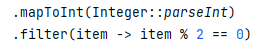
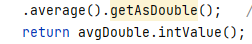
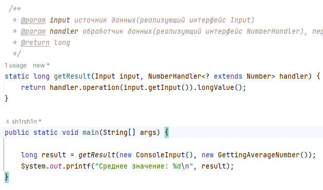

# ЗАДАНИЕ

1. Напишите программу, которая использует Stream API для обработки списка чисел. 
Программа должна вывести на экран среднее значение всех четных чисел в списке.
2. *Дополнительная задча: Переработать метод балансировки корзины товаров cardBalancing() с использованием Stream API

# РЕШЕНИЕ

_**Программа принимает на вход любую строку, 
выполняет вычисление среднего значения всех четных чисел.**_

**1. Преобразуем входящую строку в массив строк, затем в поток строк.**

**2. Выполняем фильтрацию, далее пропускаем только те строки, которые содежат числа.**

**3. Проебразуем поток строк в поток целых чисел, отфильтруем четные числа**

**4. Вычисляем среднее значение, выводим результат**

**5. В класс _MainApp_ добавлен метод _getResult_, на вход которому передаются, класс реализующий интерфейс _Input_ (источник данных)
и класс реализующий интерфейс _NumberHandler_ (обработчик чисел)**

**Результат вычислений:**

